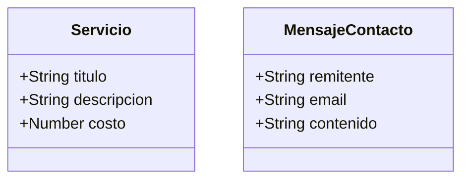

# Ontología Conceptual

## Diagrama de la Ontología

## Descripción textual

- **Servicio:** Representa un servicio ofrecido por la plataforma. Tiene título, descripción y costo.
- **Mensaje de Contacto:** Representa un mensaje enviado por un usuario a través del formulario de contacto. Incluye remitente, email y contenido.

## Clases de Agentes

### AgenteServicio
- **Descripción**: Agente encargado de gestionar la información y operaciones relacionadas con los servicios.
- **Responsabilidades**:
  - Obtener lista de servicios
  - Obtener detalles de un servicio específico
  - Gestionar la presentación de servicios

### AgenteContacto
- **Descripción**: Agente encargado de gestionar la comunicación con los usuarios.
- **Responsabilidades**:
  - Procesar mensajes de contacto
  - Almacenar información de contacto
  - Validar datos de contacto

## Clases de Conceptos

### Servicio
- **Atributos**:
  - titulo: String
  - descripcion: String
  - costo: Number
- **Relaciones**:
  - Es gestionado por: AgenteServicio

### MensajeContacto
- **Atributos**:
  - remitente: String
  - email: String
  - contenido: String
- **Relaciones**:
  - Es procesado por: AgenteContacto

## Relaciones y Propiedades

1. **AgenteServicio → Servicio**
   - Tipo: Gestiona
   - Cardinalidad: 1:N
   - Descripción: Un AgenteServicio gestiona múltiples Servicios

2. **AgenteContacto → MensajeContacto**
   - Tipo: Procesa
   - Cardinalidad: 1:N
   - Descripción: Un AgenteContacto procesa múltiples MensajesContacto

## Reglas y Restricciones

1. Todo Servicio debe tener un título y una descripción
2. Todo MensajeContacto debe tener un remitente y un email válido
3. Los costos de los Servicios deben ser valores numéricos positivos
4. Los emails en MensajeContacto deben tener un formato válido 